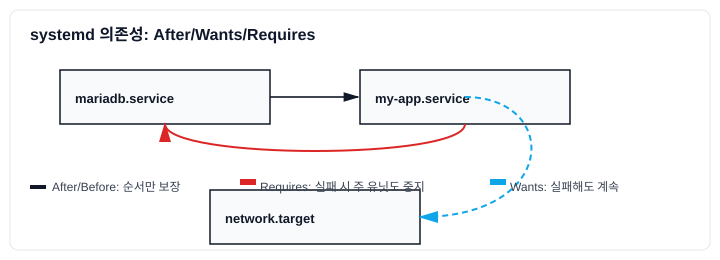

# 3-1-1: 서비스 운영 표준: systemd 유닛/의존성 (`After`, `Wants`, `Requires`)

`systemd`는 단순히 서비스를 시작하고 중지하는 것을 넘어, 서비스 간의 복잡한 **의존성(Dependency)**을 정의하고 관리하여 시스템의 부팅 프로세스와 서비스 시작 순서를 안정적이고 예측 가능하게 만듭니다. 올바른 의존성 설정은 안정적인 서버 운영의 가장 기본이 되는 표준입니다.



## `[Unit]` 섹션: 의존성의 핵심

서비스 유닛 파일의 `[Unit]` 섹션은 해당 서비스가 다른 유닛들과 어떤 관계를 맺고 있는지를 정의합니다. 주요 지시어는 `After`, `Before`, `Wants`, `Requires`입니다.

### 1. 순서(Ordering) 의존성: `After`와 `Before`

- **`After`**: "~다음에 실행되어야 함"을 의미합니다. 가장 흔하게 사용되는 순서 의존성입니다.
    - `After=network.target mysql.service`: 이 서비스는 `network.target`과 `mysql.service`가 시작된 **이후에** 시작됩니다.
    - 이는 단지 시작 순서만 정의할 뿐, `network.target`이나 `mysql.service`가 성공적으로 시작되었는지를 보장하지는 않습니다.

- **`Before`**: `After`의 반대 개념으로, "~보다 먼저 실행되어야 함"을 의미합니다.
    - `Before=httpd.service`: 이 서비스는 `httpd.service`가 시작되기 **전에** 시작되어야 합니다.

### 2. 요구(Requirement) 의존성: `Wants`와 `Requires`

`Wants`와 `Requires`는 특정 유닛이 시작될 때, 여기에 명시된 다른 유닛들도 함께 시작되도록 하는 의존성입니다. 이 둘의 가장 큰 차이는 의존하는 유닛의 실패를 어떻게 처리하느냐에 있습니다.

- **`Wants` (느슨한 의존성 - "원한다")**: 가장 일반적인 요구 의존성입니다.
    - `Wants=another.service`: 이 서비스가 시작될 때, `systemd`는 `another.service`도 함께 시작하려고 시도합니다.
    - **하지만 `another.service`가 시작에 실패하더라도, 이 서비스는 계속 시작을 시도합니다.**
    - `systemctl enable`로 서비스를 활성화하면, `WantedBy`에 지정된 `target`의 `.wants` 디렉터리에 심볼릭 링크가 생성됩니다. (예: `/etc/systemd/system/multi-user.target.wants/my-app.service`)

- **`Requires` (강력한 의존성 - "반드시 필요하다")**: 매우 강력하고 필수적인 관계를 정의합니다.
    - `Requires=another.service`: 이 서비스가 시작될 때, `another.service`도 반드시 함께 시작되어야 합니다.
    - **만약 `another.service`가 시작에 실패하면, 이 서비스는 아예 시작되지 않습니다.**
    - 또한, 이 서비스가 실행되는 동안 `another.service`가 중지되면, 이 서비스도 함께 중지됩니다.
    - `systemctl enable` 시 `.requires` 디렉터리에 심볼릭 링크가 생성됩니다.

### 의존성 조합 예시

일반적으로 `After`와 `Wants`/`Requires`는 함께 사용되어 "**언제, 무엇과 함께**" 실행될지를 명확히 합니다.

- **시나리오**: 내 웹 애플리케이션(`my-app.service`)은 데이터베이스(`mariadb.service`)가 준비된 이후에 시작되어야 하며, 데이터베이스 없이는 실행될 수 없다.

- **`my-app.service` 유닛 파일 설정**:
  ```ini
  [Unit]
  Description=My Application
  # 1. 순서: mariadb.service가 시작된 이후에 시작한다.
  After=mariadb.service
  
  # 2. 요구사항: mariadb.service가 반드시 필요하다.
  Requires=mariadb.service

  [Service]
  ExecStart=/usr/bin/my-app
  ...
  ```
  - 위 설정은 `my-app.service`가 시작될 때, `systemd`가 다음을 보장하도록 합니다:
    1. `mariadb.service`를 먼저 시작시킨다.
    2. `mariadb.service`가 성공적으로 시작되면, 그 후에 `my-app.service`를 시작한다.
    3. 만약 `mariadb.service`가 실패하면, `my-app.service`는 시작되지 않는다.

- **만약 `Requires` 대신 `Wants`를 사용했다면?**
  `After=mariadb.service`와 `Wants=mariadb.service`를 사용했다면, `mariadb.service`가 실패하더라도 `my-app.service`는 시작을 시도할 것입니다. 이 경우, 앱은 데이터베이스에 연결할 수 없어 곧바로 오류를 내고 종료될 가능성이 높습니다.

추가 팁: 네트워크가 실제로 사용 가능함을 보장하려면 `network-online.target`과 대기 유닛을 조합합니다.

```ini
[Unit]
After=network-online.target
Wants=network-online.target

# 배포판에 따라
# systemd-networkd: systemd-networkd-wait-online.service
# NetworkManager: NetworkManager-wait-online.service
```

### 의존성 확인

`systemctl list-dependencies` 명령어를 사용하면 특정 유닛의 전체 의존성 트리를 확인할 수 있습니다.

```bash
# my-app.service의 모든 의존성 확인
systemctl list-dependencies my-app.service

# my-app.service를 필요로 하는 역의존성 확인
systemctl list-dependencies --reverse my-app.service
```

올바른 의존성 설정은 복잡한 시스템에서 서비스들이 예측 가능하고 질서정연하게 시작되고 종료되도록 보장하는 핵심적인 기술입니다. 특히 마이크로서비스 아키텍처와 같이 여러 서비스가 상호작용하는 환경에서 그 중요성은 더욱 커집니다.
