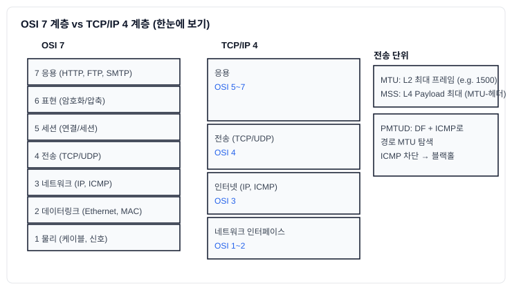

# 4-1-1: OSI/TCP-IP 계층, MTU/MSS/PMTUD

네트워크 트러블슈팅을 효과적으로 수행하려면, 데이터가 어떻게 여러 계층을 거쳐 전송되는지에 대한 기본적인 이해가 필수적입니다. 여기서는 네트워크 통신의 기본 모델인 OSI 7계층과 TCP/IP 4계층, 그리고 데이터 전송 단위와 관련된 중요한 개념인 MTU, MSS, PMTUD에 대해 알아봅니다.

## 1. 네트워크 계층 모델

### 한눈에 보기 (OSI ↔ TCP/IP)



위 다이어그램은 OSI 7계층과 TCP/IP 4계층의 매핑을 한눈에 보여줍니다. 실무에서는 TCP/IP 모델을 기준으로 사고하되, 문제 원인을 추적할 때 OSI 관점으로 계층을 좁혀가는 방식이 효과적입니다.

네트워크 통신의 복잡한 과정을 역할별로 나누어 설명하는 모델입니다.

### OSI 7계층 모델
- 국제표준화기구(ISO)에서 제정한 표준 모델로, 네트워크 통신을 7개의 추상적인 계층으로 나누어 설명합니다. 이론적이고 교육적인 목적으로 많이 사용됩니다.

  7.  **응용 계층 (Application)**: 사용자가 직접 상호작용하는 계층 (예: HTTP, FTP, SMTP)
  6.  **표현 계층 (Presentation)**: 데이터의 형식을 변환, 암호화, 압축하는 계층.
  5.  **세션 계층 (Session)**: 두 컴퓨터 간의 통신 세션을 만들고, 유지하며, 종료하는 계층.
  4.  **전송 계층 (Transport)**: 종단 간(End-to-End)의 신뢰성 있는 데이터 전송을 담당. (예: **TCP**, **UDP**)
  3.  **네트워크 계층 (Network)**: 데이터에 논리적 주소(IP 주소)를 부여하고, 목적지까지 최적의 경로를 찾아주는 라우팅을 담당. (예: **IP**, ICMP)
  2.  **데이터 링크 계층 (Data Link)**: 물리적 네트워크(이더넷 등)를 통해 직접 연결된 두 노드 간의 신뢰성 있는 데이터 전송을 담당. 물리적 주소(MAC 주소)를 사용. (예: 이더넷, 스위치)
  1.  **물리 계층 (Physical)**: 데이터를 전기적 신호(0과 1)로 변환하여 케이블을 통해 전송하는 계층. (예: 케이블, 허브, 리피터)

### TCP/IP 4계층 모델
- 현재 인터넷에서 실제로 사용되는 프로토콜 스위트(TCP/IP)를 기반으로 한 실용적인 모델입니다.

  4.  **응용 계층 (Application)**: OSI의 5, 6, 7계층에 해당. (HTTP, FTP, DNS 등)
  3.  **전송 계층 (Transport)**: OSI의 4계층에 해당. (TCP, UDP)
  2.  **인터넷 계층 (Internet)**: OSI의 3계층에 해당. (IP, ICMP, 라우터)
  1.  **네트워크 인터페이스 계층 (Network Interface)**: OSI의 1, 2계층에 해당. (이더넷, MAC 주소, 스위치)

## 2. MTU, MSS, PMTUD: 데이터 전송 단위의 비밀

네트워크 통신에서 데이터는 한 번에 보낼 수 있는 크기가 제한되어 있습니다. 이 크기를 이해하는 것은 네트워크 성능 문제와 연결 실패의 원인을 찾는 데 매우 중요합니다.

### MTU (Maximum Transmission Unit, 최대 전송 단위)
- **개념**: 네트워크 인터페이스 계층(L2)에서 한 번에 보낼 수 있는 **최대 데이터의 크기**입니다. 이더넷(Ethernet) 환경에서는 일반적으로 **1500 바이트**입니다.
- **구성**: MTU는 IP 헤더, TCP 헤더, 그리고 실제 데이터(Payload)를 모두 포함한 크기입니다.
  `MTU (1500) = IP Header (20) + TCP Header (20) + TCP Payload (1460)`
- **확인 방법**:
  ```bash
  ip a | grep mtu
  # 또는
  ifconfig | grep mtu
  ```

### MSS (Maximum Segment Size, 최대 세그먼트 크기)
- **개념**: 전송 계층(L4)에서 한 번에 보낼 수 있는 **순수 데이터(Payload)의 최대 크기**입니다. MSS는 MTU를 초과하지 않도록 TCP 3-way-handshake 과정에서 양쪽 통신 장비 간에 협상됩니다.
- **계산**: 일반적으로 `MSS = MTU - (IP 헤더 크기 + TCP 헤더 크기)` 입니다.
  `MSS (1460) = MTU (1500) - IP Header (20) - TCP Header (20)`

### 단편화 (Fragmentation)
- **개념**: 라우터가 수신한 패킷의 크기가 다음 홉(hop)의 MTU보다 클 경우, 라우터는 해당 패킷을 여러 개의 작은 조각으로 나누어 전송합니다. 이를 **단편화**라고 합니다.
- **문제점**: 단편화와 재조립 과정은 라우터와 수신 측 시스템에 부하를 주며, 패킷 조각 중 하나라도 유실되면 전체 패킷을 다시 전송해야 하므로 네트워크 성능 저하의 주요 원인이 됩니다.

### PMTUD (Path MTU Discovery, 경로 MTU 탐색)
- **개념**: 단편화를 피하기 위해, 통신 경로 전체에서 허용되는 **가장 작은 MTU(Path MTU)**를 찾아내고, 데이터 전송 크기를 그에 맞추는 메커니즘입니다.
- **동작 원리**:
    1.  송신 측은 자신의 패킷에 **DF(Don't Fragment)** 비트를 설정하여 보냅니다. "이 패킷은 단편화하지 마시오"라는 의미입니다.
    2.  중간 라우터가 이 패킷을 받았는데, 자신의 MTU보다 패킷이 커서 단편화해야 하는 상황이 오면, 라우터는 패킷을 버리고 "**ICMP Destination Unreachable (Fragmentation Needed)**" 메시지를 송신 측으로 보냅니다. 이 ICMP 메시지에는 해당 라우터의 MTU 정보가 포함되어 있습니다.
    3.  송신 측은 이 ICMP 메시지를 받고, 자신의 패킷 크기(MSS)를 더 작게 조절하여 다시 전송합니다.
    4.  이 과정을 반복하여 경로상의 최소 MTU를 찾아냅니다.

- **트러블슈팅**: 만약 중간 경로의 방화벽에서 **ICMP 메시지를 차단**하면, 송신 측은 왜 패킷이 도달하지 않는지 알 수 없게 됩니다. 패킷은 계속 유실되고, PMTUD가 실패하여 결국 통신이 멈추는 현상(Black Hole)이 발생합니다. **"특정 사이트만 접속이 안 돼요"** 와 같은 문제의 상당수가 바로 이 ICMP 차단으로 인한 PMTUD 실패 때문입니다.

### 실습: 경로 MTU 감 잡기

```bash
# DF 비트를 유지(-M do)하고 페이로드 크기(-s)를 늘려가며 실패 지점 확인
ping -M do -s 1472 8.8.8.8   # 1472 + 28(IP+ICMP 헤더) ≈ 1500

# 중간에서 ICMP가 차단되어 블랙홀이라면, 트레이스 + 패스 MTU 확인을 병행
mtr -ezbw 8.8.8.8            # ICMP 응답 유무/지연 가시화
```

Tip: 터널(예: VXLAN/GRE/WireGuard)이 있으면 캡슐화 오버헤드만큼 MTU를 더 줄여야 합니다.
