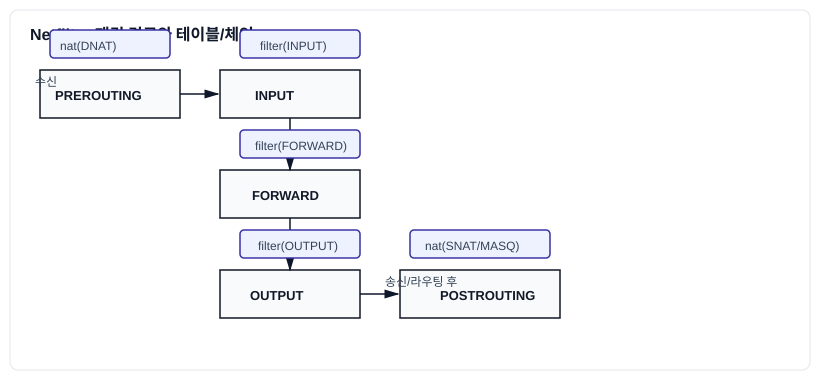

# 4-3-1: `iptables`/`nftables` 개념 및 테이블/체인

리눅스 커널의 Netfilter 프레임워크는 네트워크 패킷이 커널을 통과하는 과정의 여러 지점에 "훅(hook)"을 제공하여, 패킷을 검사하고 조작할 수 있게 해줍니다. `iptables`와 `nftables`는 이 Netfilter 훅을 제어하는 사용자 공간 도구로, 리눅스 방화벽의 근간을 이룹니다.

### 패킷 경로 한눈에



이 흐름도를 기준으로 "어떤 테이블/체인의 규칙이 적용되는가?"를 빠르게 위치시킬 수 있습니다.

## 1. `iptables`: 전통적인 패킷 필터링

`iptables`는 오랫동안 리눅스의 표준 방화벽으로 사용되어 왔으며, **테이블(Table) → 체인(Chain) → 규칙(Rule)** 이라는 계층적인 구조를 가집니다.

### `iptables`의 구조

1.  **규칙 (Rule)**: 패킷의 출발지 IP, 목적지 포트 등 특정 조건과, 그 조건에 일치할 때 무엇을 할지(타겟, 예: `ACCEPT`, `DROP`)를 정의한 개별 항목입니다.

2.  **체인 (Chain)**: 규칙들의 순차적인 목록입니다. 패킷은 체인의 첫 번째 규칙부터 순서대로 검사를 받으며, 일치하는 규칙을 만나면 해당 타겟을 수행하고 체인 검사를 종료합니다. (일부 예외 제외)
    - **기본 내장 체인**:
        - `INPUT`: 서버 자신으로 들어오는 패킷 (로컬 프로세스로 향하는 패킷).
        - `OUTPUT`: 서버 자신에서 나가는 패킷 (로컬 프로세스에서 생성된 패킷).
        - `FORWARD`: 서버를 통과하여 다른 곳으로 전달(라우팅)되는 패킷.

3.  **테이블 (Table)**: 특정 목적을 가진 체인들의 모음입니다. `iptables`에는 여러 테이블이 있지만, 가장 중요한 것은 `filter`와 `nat` 테이블입니다.

### 주요 `iptables` 테이블

- **`filter` 테이블**: 가장 기본적이고 널리 사용되는 테이블로, 패킷을 **허용(ACCEPT)**하거나 **거부(DROP)**할지를 결정합니다. `INPUT`, `OUTPUT`, `FORWARD` 세 개의 기본 체인을 가집니다.

- **`nat` (Network Address Translation) 테이블**: 네트워크 주소를 변환하는 역할을 합니다. 주로 사설 IP를 공인 IP로 바꾸거나(Source NAT), 공인 IP로 들어온 요청을 내부의 사설 IP로 전달(Destination NAT)하는 데 사용됩니다.
    - **주요 체인**:
        - `PREROUTING`: 패킷이 라우팅 결정을 거치기 전에 주소를 변경합니다. (주로 DNAT에 사용)
        - `POSTROUTING`: 패킷이 라우팅 결정을 거쳐 나가기 직전에 주소를 변경합니다. (주로 SNAT에 사용)
        - `OUTPUT`: 로컬에서 생성된 패킷의 목적지 주소를 변경합니다.

### `iptables` 명령어 사용법

`iptables -t [테이블] [옵션] [체인] [조건] -j [타겟]`

```bash
# filter 테이블의 INPUT 체인에 규칙 추가 (-A, append)
# 출발지 IP가 1.2.3.4이고 TCP 프로토콜이며 목적지 포트가 22번인 패킷을 거부(DROP)
sudo iptables -t filter -A INPUT -s 1.2.3.4 -p tcp --dport 22 -j DROP

# nat 테이블의 POSTROUTING 체인에 규칙 추가
# eth0 인터페이스로 나가는 모든 패킷의 출발지 주소를 해당 인터페이스의 IP로 변경 (SNAT/Masquerade)
sudo iptables -t nat -A POSTROUTING -o eth0 -j MASQUERADE
```

### 치트시트: `iptables` → `nftables` 사고 전환

- 체인 기본 정책: `iptables -P INPUT DROP` ≈ `nft add chain inet filter input { type filter hook input priority 0; policy drop; }`
- 매치 구성: `-s / -d / -p / --dport` → `ip saddr / ip daddr / tcp dport`
- 상태 매치: `-m state --state ESTABLISHED,RELATED` → `ct state established,related accept`
- NAT: `-t nat -A POSTROUTING -o eth0 -j MASQUERADE` → `add rule inet nat postrouting oifname "eth0" masquerade`

## 2. `nftables`: 차세대 패킷 필터링

`nftables`는 `iptables`의 복잡성, 중복성, 성능 문제를 해결하기 위해 등장한 차세대 패킷 필터링 프레임워크입니다. `iptables`와 하위 호환성을 제공하면서도 더 직관적이고 유연한 구조를 가집니다.

### `nftables`의 특징

- **단일화된 도구**: `iptables`, `ip6tables`, `arptables` 등 여러 도구가 `nft`라는 단일 명령어로 통합되었습니다.
- **새로운 문법**: `iptables`의 복잡한 옵션 대신, 더 간결하고 구조적인 설정 언어를 사용합니다.
- **성능 개선**: 내부적으로 더 효율적인 자료 구조를 사용하여 많은 수의 규칙을 처리할 때 성능이 향상되었습니다.
- **테이블/체인의 완전한 자유**: `iptables`와 달리, 사용자가 테이블과 체인을 자유롭게 생성하고 구성할 수 있습니다. 기본적으로는 `filter` 테이블과 `input`, `forward`, `output` 체인을 가진 `inet` 패밀리 테이블이 생성됩니다.

### `nftables` 명령어 사용법

- **규칙 세트 보기**:
  `sudo nft list ruleset`

- **규칙 추가**:
  `sudo nft add rule [패밀리] [테이블] [체인] [조건] [타겟]`

  ```bash
  # inet 패밀리의 filter 테이블 input 체인에 규칙 추가
  # ip saddr(출발지 주소) 1.2.3.4 tcp dport(목적지 포트) 22 drop
  sudo nft add rule inet filter input ip saddr 1.2.3.4 tcp dport 22 drop

  # SNAT 규칙 추가
  sudo nft add rule inet nat postrouting oifname "eth0" masquerade
  ```

- **파일 기반 설정**: `nftables`는 `/etc/nftables.conf` 파일을 통해 전체 규칙 세트를 원자적(atomic)으로 로드하고 관리하는 것을 권장합니다. 이는 `iptables-save`/`iptables-restore` 방식보다 더 안정적입니다.

### `iptables` vs `nftables`

| 구분 | `iptables` | `nftables` |
| --- | --- | --- |
| **구조** | 고정된 테이블과 체인 | 자유로운 테이블과 체인 구성 |
| **명령어** | `iptables`, `ip6tables` 등 분리 | `nft` 단일 명령어로 통합 |
| **문법** | 복잡한 옵션 기반 | 간결하고 구조적인 스크립트 언어 |
| **성능** | 규칙이 많아지면 성능 저하 | 대량의 규칙 처리 시 성능 우수 |
| **최신 배포판** | 여전히 사용 가능 (호환성 레이어) | 기본 방화벽 백엔드로 채택 (RHEL 8+, Debian 10+) |

최신 리눅스 시스템에서는 `firewalld`나 `ufw`와 같은 고수준 방화벽 관리 도구를 사용하더라도, 그 내부 동작 방식은 `iptables` 또는 `nftables`를 기반으로 합니다. 따라서 이들의 기본 개념인 테이블과 체인, 그리고 패킷의 흐름을 이해하는 것은 방화벽 관련 문제를 깊이 있게 해결하는 데 필수적입니다.
